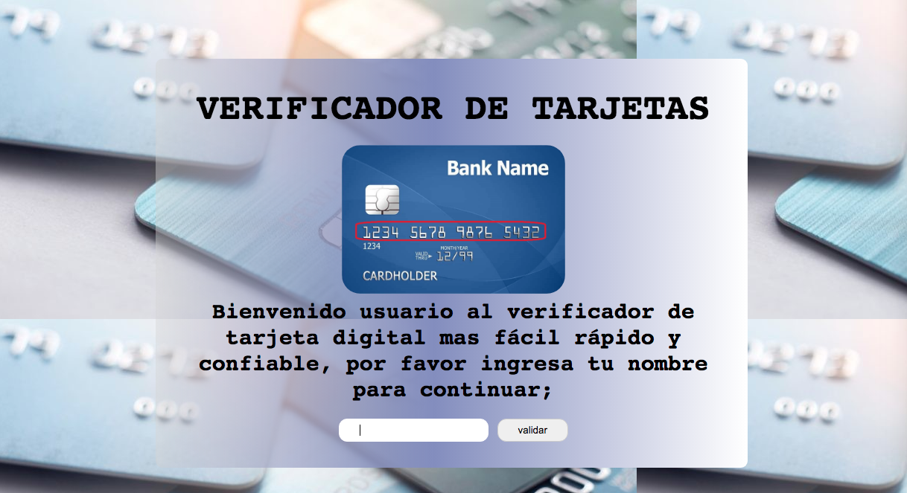

# Tarjeta de credito valida :technologist: 	:credit_card:

##Objetivo del programa :pencil:

 El fin de este programa es poder validar tarjetas de credito, a traves del algoritmo de luhn. con el fin de que sea adcesible a todo tipo de personas posean una tarjeta dando una experiencia dinamica.

 Algoritmo de lunh : metodo creado para la verificacion de numeros de identicicacion, como los numeros de las tarjetas de credito (visa,masterCard) o el IMEI de los telefonos moviles. El algoritmo fuciona de la siguiente manera:

 1.Tomo los numeros obtenidos con un array y trabajo con los indice de dicho array,  obtengo el primer numero, que con la funcion (if(i+1)%2!=0) nombro al primer numero como 1 (en primer indice del caracter en  javascript es denominado "0") donde me permite tomar los numeros impares. 

 2. Sumar los digitos del resultado: (ejemplo: 16 = 1 + 6 = 7) junto con los dijitos sin duplicar del numero original.

 3. Si el total del modulo 10 es igual a 0 (si el total termina en cero), entonces el numero es valido de acuerdo con la formula luhn, de lo contrario no es valido.

 ## Foto de prototipo :nerd_face:

 

 ## Fotos de los avances :grinning:

<<<<<<< HEAD
 

 

 

 

 Este empieza con una bienvenida dandote un pequeño resumen de como puedes usarla, lo importante es colocar tu nombre, de ahi te pide el numero de tarjeta que vas a verificar dandote una de las dos alternativas;
=======
![] (1.jpg)

![] (2.jpg)

![] (3.jpg)

![] (4.jpg)
>>>>>>> 0f9a603beb4822e4c49e73f488a63789af41db53

 1.Tu tarjate es valida (quiere decir que si posees una tarjeta existente).

 2.Tu tarjeta es invalida (colocaste un numero mal, o no existe esa tarjeta). 

## Feedback :pushpin:

Mi squad me dio buen visto por los primeros bocetos mostrados, solo debia darle mas contenido para asi tener mas personalidad la paguina wed, dando asi mas confianza al usuario.

## Prototipo Final :champagne:

<<<<<<< HEAD

=======
## Prototipo Final :champagne:
>>>>>>> 0f9a603beb4822e4c49e73f488a63789af41db53
